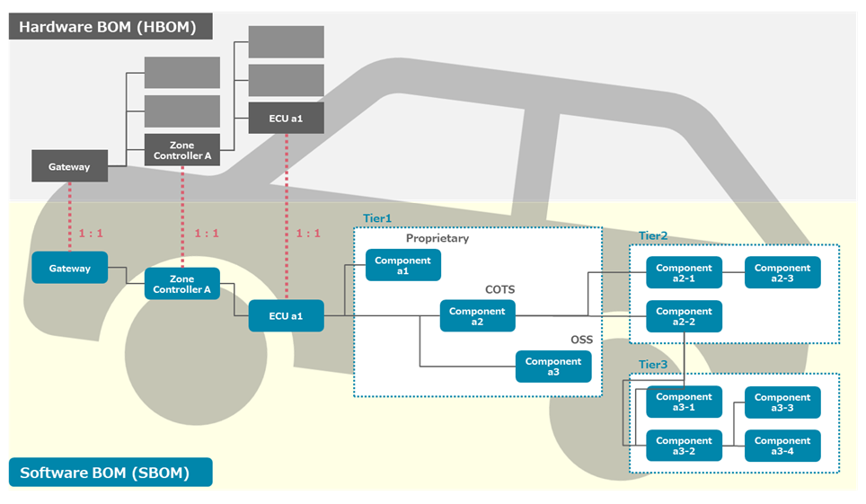
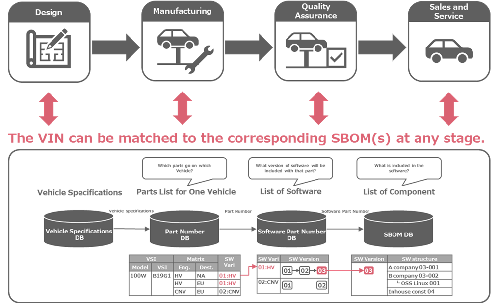
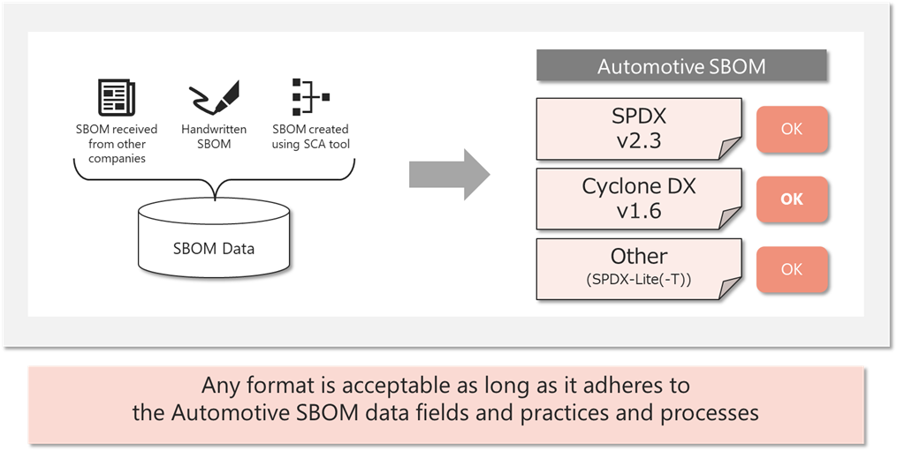
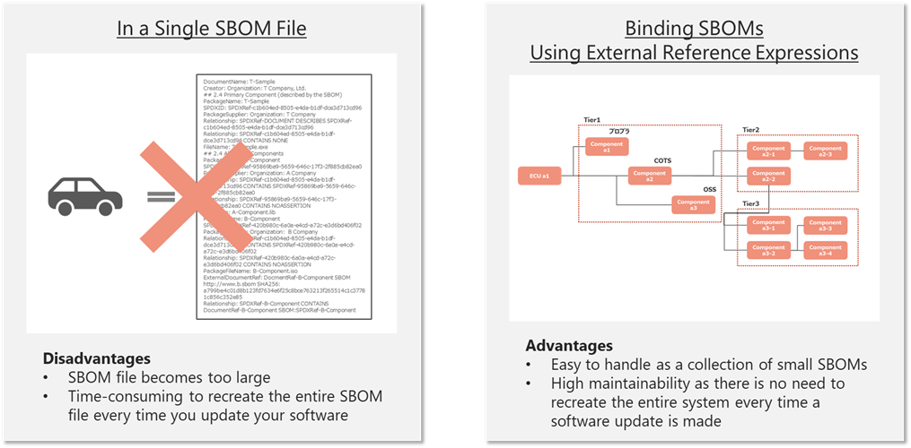
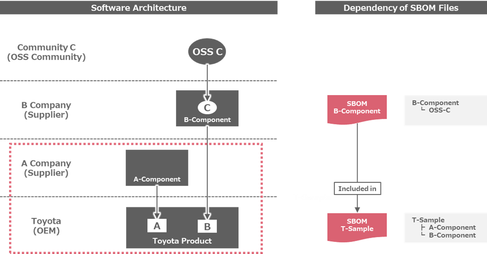

# Overview of Automotive SBOM
## Background
SBOM (Software Bill of Materials, a list of the components that make up software) was defined as a means of visualizing the components of software, and is expected to be used in a variety of industries for risk management purposes such as vulnerability and license compliance. The basic SBOM specification definition published by the NTIA of the United States in 2021 is referenced as the de facto global standard, and there are multiple definitions derived from it, but it is defined generically to cover a variety of areas such as SI (system integration) and embedded device development, and when applied to business practices and development methods specific to the automotive industry, issues arise such as the granularity of information and ambiguity of definitions.

## Objectives of Automotive SBOM
To solve the above issues, Automotive SBOM is defined as an SBOM standard that follows the general-purpose SBOM specifications but has reconsidered its content specifically for use in the automotive industry. The objectives of Automotive SBOM are as follows:
- Use as a common standard in the automotive supply chain
OEMs, as final distributors, are required to carry out various risk management measures to fulfill their safety responsibilities, but this requires that suppliers provide the necessary information accurately and without omission or excess. The Automotive SBOM defines the format, content, and granularity of the information required by OEMs, and by being used as a common guideline for each supplier to create an SBOM that meets the requirements for good products, it will improve transparency and traceability throughout the supply chain.
- Contributing to improving productivity in the automotive industry
The Automotive SBOM specifications were created with the intention of being commonly used by OEMs both in Japan and overseas. Currently, because the SBOM specifications required by each OEM differ, suppliers individually create and provide SBOMs tailored to each OEM's requirements, which consumes a lot of person-hours. Standardizing the requirements from OEMs to suppliers will reduce the burden on suppliers in complying with SBOMs and contribute to improving productivity throughout the automotive industry.
- Use as a requirement specification for tool vendors
The information that will become the content of SBOM is generally collected from the target software using an SCA tool, but the functionality and performance of the SCA tools currently available in the market are not perfect. Furthermore, selecting the most suitable SCA tool for use in the automotive industry from among the multiple tools available requires desk research, benchmarking, and performance evaluation, which is difficult for each development team at each company to carry out. The Automotive SBOM specification can be used as a means of specifically communicating the requirements for functional enhancements needed in the automotive industry to SCA tool vendors, and as a criterion for each development team to select tools.

 
 
 

# The Role of SBOM in Vehicle Development
## Representation of SBOM for One Car
To achieve SBOM-based management aimed at addressing various risks and complying with regulations while maintaining the traditional vehicle development system, the goal in the future is to represent the SBOM for an entire vehicle by associating management using PLM ( Product Lifecycle Management , information management centered on hardware development) with ALM ( Application Lifecycle Management , information management centered on software development). An image of how the SBOM for an entire vehicle would be represented is shown in Figure 1.
The HBOM  (Hardware Bill of Materials, a list of the hardware that makes up a vehicle, as [HBOM defined by CISA](https://www.cisa.gov/resources-tools/resources/hardware-bill-materials-hbom-framework-supply-chain-risk-management) ) makes it possible to visualize the system structure of components such as ECUs. By associating and managing an SBOM with each of these components, it is possible to understand the software configuration of an entire vehicle. Rather than having one huge SBOM associated with an entire vehicle, the hierarchical structure of the SBOM is used, and the SBOM for each component is bundled using an external reference representation, making it easier to handle and maintain.

Figure 1 SBOM representation image for one car (ToBe)

## Relationship between Post-shipment Traceability Management and SBOM
The state of a vehicle's software changes due to various reprocessing processes that are carried out after manufacturing and shipping, so the associated SBOM must also be updated accordingly. For this reason, each association is designed to enable traceability from the VIN for individual vehicle management, via the software part number corresponding to that VIN, to the corresponding SBOM. Figure 2 shows an image of traceability management at each stage.
Furthermore, with the widespread use of in-vehicle software updates using OTA technology , it is expected that the software configuration of each vehicle will differ after shipment. Even in this situation, the use of SBOM is expected to become more widespread, as traceability of the corresponding SBOM from the VIN will enable compliance with regulations ( such as UN-R156 ) and reliable vulnerability response.

Figure 2 Post-shipment traceability management 

 
 
 

# Automotive SBOM Specifications
## Automotive SBOM Specification Configuration
The Automotive SBOM specification consists of the following definitions:
- Data Fields
Definition of data items to be handled as SBOM
- Automation Support
Document format that SBOM files should comply with, definition of each data format, and implementation example
- Practice and Process
Define operational methods for requesting, generating, and using SBOM

The prerequisite for considering the definition of the Automotive SBOM specification are as follows:
1. The data field is defined as the minimum data set required to understand the configuration information of the components (OSS, COTS, proprietary software, and completely in-house developed software) contained in the managed software.
1. Each data field has an attribute of either Required or Optional. Optional data items can be used or not depending on the implementation requirements of each entity.
1. There will be no data fields for dynamic information, such as vulnerability information. Instead, the data fields will contain information necessary to appropriately detect and manage risks associated with the managed software.
1. As a means of detecting associated risks, each component, which is configuration information, is uniquely identified and can be matched with external data.
1. Identify each component's known security vulnerabilities, applicable licenses, and providing entities as a means of detecting associated risks.
1. There will be no data fields for managing entity-specific information, such as model information. This information will be defined separately as an implementation requirement for each entity as a schema outside the SBOM.

The reasons for not simply adopting existing industry standards are as follows:
- Standards such as CISA Baseline Attribute, NTIA Minimum Elements, and BSI TR-03183 do not support data items used by automotive OEM intellectual property departments for license verification, such as the URL of the component source and whether it has been modified. The same applies to the definition of minimum SBOM elements by J-Auto-ISAC.
- The OpenChain Telco SBOM Guide Version 1.1 is SPDX-based, and restricting the SBOM document format may not be consistent with automotive industry practices.

## Data Fields
### Data Field Definitions
The Automotive SBOM data field definitions are shown in Table 1.

Table 1 Automotive SBOM Data Field Definitions
|#|Automotive SBOM Data Fields|Required|Purpose|
|:--:|:--|:--:|:--|
|1|SBOM Metadata|
|1-1|SBOM Author Name|〇|Identifying the entity that will create the SBOM|
|1-2|SBOM Timestamp|〇|Identifying the development phase of the target component|
|1-3|SBOM Type|〇|Identifying the development phase of the target component|
|1-4|SBOM Primary Component|〇|Identifying target components|
|2|Component attribute|
|2-1|Component Name|〇|Identifying target components|
|2-2|Component Version|〇|Identifying the version of the component in question|
|2-3|Component Supplier Name|〇|Identifying suppliers of affected components|
|2-4|Component Relationship|〇|Identifying dependencies of target components|
|2-5|Component Unique Identifier|〇|Used to match target components with external data|
|2-6|Component File Name|〇|Used to check the license of the target component|
|2-7|Component Download Location|-|Used to check the license of the target component|
|2-8|Component Declared License|-|Used to check the license of the target component|
|2-9|Component Concluded License|〇|Used to check the license of the target component|
|2-10|Component Cryptographic Hash|-|Used to verify the authenticity of the target component|
|2-11|Component Copyright Notice|〇※|Used to check the copyright of the target component|
|2-12|Component External Document References|〇|Used for matching with external SBOM|
  
(Legend: 〇: Required, - :  Optional)  
  
  
The Automotive SBOM data fields are described below.  

 

---
#### 1  SBOM Metadata  
####     1.1  SBOM Author Name  
<ins>Description and Uses</ins>  
- Used to uniquely identify the SBOM creation entity.
- This information identifies the entity that created (provided) the SBOM, and should be a company name or individual name. Multiple entities are allowed.
- Include the legal entity name and unique identifier (e.g., email address, website) if available. If the legal entity name is not available, include the name of the SBOM creator along with contact information such as an email address.
- If possible, include information about the tools and versions used by the SBOM creator to create the SBOM (this can be used to judge the quality of the SBOM).  

<ins>Specific examples</ins>  
"creators": ["Organization: T Company, Ltd. ", "Tool: BlackDuck v2024.10.1"]
 
####     1.2  SBOM Timestamp
<ins>Description and Uses</ins>  
- Used to identify the date and time the SBOM was created or updated.
- Be represented in a format that is consistent across time zones and locales ( e.g., ISO 860111 ).

<ins>Specific examples</ins>  
"created": "2025-01-24T22:31:37Z"

####     1.3  SBOM Type
<ins>Description and Uses</ins>  
- Used to identify the timing and target of the SBOM.
- Expressed using the CISA SBOM Types described in Chapter 8.4.

<ins>Specific examples</ins>  
" creator comment ": [" Type : Build "]

####     1.4  SBOM Primary Component
<ins>Description and Uses</ins>  
- Used to identify the target component that the SBOM represents.
- Generally, the name of the target software (product, function name, etc.) is assumed, but the project name or various codes (software product number, etc.) within each entity may also be used.

<ins>Specific examples</ins>  
" name " : "T-Sample" (if using the software name), " xxxxx-xxxxx " (if using the software model number)

#### 2  Component Attributes  
####     2.1  Component Name  
<ins>Description and Uses</ins>  
- Used to identify the component.
- Generally, the name of the target software (product, function name, etc.) is assumed, but the project name or various codes (software product number, etc.) within each entity may also be used.  

<ins>Specific examples</ins>  
" name " : "A-Component " ( if using the function name), " xxxxx-xxxxx " ( if using the software part number)

####     2.2  Component Version  
<ins>Description and Uses</ins>  
- A version number to identify the version of the component. If unique version of information is not provided, a hash value of the component is used.

<ins>Specific examples</ins>  
“ versionInfo ” : “ 1.0.a ”

####     2.3  Component Supplier Name  
<ins>Description and Uses</ins>  
- A name that uniquely identifies the entity providing the component. If the company name has changed since the SBOM was created due to a merger or acquisition, the content of this item will be changed when the SBOM is updated.
- If the component is COTS or proprietary software, the legal entity name should be used in this field. If the legal entity name is not unique, jurisdiction information may be added.
- If the component is OSS, this field should contain the name of the OSS project. If possible, add the name of the organization hosting the project (e.g., Apache Tomcat ). The OSS copyright statement may be used to identify the project name (e.g., " Meta Platforms, Inc. and affiliates" ).
- If it is difficult to identify the supplier, you may use the domain URL or namespace information of the PURL of the software in question. The use of " unknown " is also permitted, but it is recommended that you do not use it too often.
-If a component provided by a higher-level supplier is used without modification, the name of the higher-level supplier should be used in this field. If the component has been modified by the supplier of the SBOM Primary Component , the name of the supplier of the SBOM Primary Component should be used in this field. Furthermore, information about the higher-level supplier should be conveyed using the Relationship field ( see Chapter 8.3 for details).

<ins>Specific examples</ins>  
"supplier": "Organization : B -Company "

####     2.4  Component Relationship  
<ins>Description and Uses</ins>  
- Used to explain the relationship between the component and other components.  
- The relationships are expressed in the following types:  
  - Primary  
  A type for representing SBOM Primary Component. Specifically, DESCRIBES (in the case of SPDX), or metadata (in the case of CycloneDX) are used.
  - Includes  
  A type used to express when a component is included in or depends on another component. Specifically, CONTAINS, DEPENDS_ON, DEPENDENCY_OF, DYNAMIC_LINK, or STATIC_LINK (in the case of SPDX), or dependencies (in the case of CycloneDX) are used.  
  - Heritage , Pedigree  
 A type used to express that a given component was created by modifying another, higher-level component. Specifically, this can be represented using GENERATED_FROM or DESCENDANT_OF in SPDX, or pedigree in CycloneDX.  
- The completeness of the relationship expression can also be expressed using Unknown, None, Partial, and Known.  

<ins>Specific examples</ins>  
"Relationship: SPDXRef-2b9b148e-fb5e-3079-2f88-d5e9f39431dc CONTAINS SPDXRef-9811def5-4723-5e3f-2dbd-8c33c9ff62ae"

####     2.5  Component Unique Identifier  
<ins>Description and Uses</ins>  
- An identifier that uniquely identifies a component, which is a constituent part of a system. It is used to match the target component with external data, such as when retrieving information from a public vulnerability database.  
- Identifiers that can be used include CPE ([Common Platform Enumeration](https://cpe.mitre.org/specification/index.html) ) , PURL ([Package URL](https://github.com/package-url/purl-spec) ) , SWID ([Software Identification](https://csrc.nist.gov/projects/software-identification-swid/guidelines) ) Tagging ([ISO/IEC 19770-2:2015](https://www.iso.org/standard/65666.html) ), and SWHID ([Software Hash Identifier](https://www.softwareheritage.org/software-hash-identifier-swhid/)  ) ([ISO/IEC 18670:2025](https://www.iso.org/standard/89985.html) ).  
- Identifiers are designated as Required because they are used to match the target component with external data sources. At least one type of identifier must always be provided. Additional identifiers are optional; however, to enable cross‑referencing with various external data sources, it is desirable to include as many identifiers as possible when they are available.  
- If the component is OSS, this field should use a PURL or SWHID. If the component is COTS or proprietary software, it is recommended to use the SWID tag (Software Identification Tag) assigned by the component’s supplier; however, this is not mandatory at present.  

<ins>Specific examples</ins>  
{" cpe ": "cpe:2.3:a:systembom:bomviewer:3.2.1"} ,  
{"purl": " pkg:rpm / sysbom / bomgen "} ,  
{" swid ": "65699569-EA51-4346-8BDC - 4076FA5C0E72"} ,  
{" swhid ": " swh:1:dir:bc7ddd62cf3d72ffdc365e1bf2dea6eeaa44e185;origin=https://github.com/rdicosmo/parmap;visit=swh:1:snp:8ddca416836fbbc2a7704c69db38739bef6b 6cae;anchor=swh:1:rev:ecd3744ed558da4ea2bf9eb87b80b8949f417126 "}  

####     2.6  Component File Name  
<ins>Description and Uses</ins>  
- The file name of the component, used to identify the component and check its license.  

<ins>Specific examples</ins>  
“ PackageFileName ” : “ B.exe ”  

####     2.7  Component Download Location  
<ins>Description and Uses</ins>  
- The URL to retrieve the component.  
- If the component is open source, use the URL to obtain the source code or binary file of the component being used. A URL that can obtain a version of the component being used is preferable, but it can also be substituted with the URL of the top page of the Github repository or the download link on the project's web page.  
- If the component is COTS or proprietary , use "None" .  

Specific examples  
“ PackageDownloadLocation ” : “ http://acompany/a.zip ” , “ None ”  

####     2.8  Component Declared License  
<ins>Description and Uses</ins>  
- A list of the licenses declared by the component’s author. If the component (package) contains multiple license declarations, all of them must be included in this field.  
- License information not provided by the package author, such as license information from a third-party repository, should be expressed in #2.9 Component Concluded License rather than in this field.  
- To identify an OSS license, use the SPDX license identifier , but if one is not defined, use the name of the license as is.  
- This item is optional, and NONE is allowed if there is no declaration by the component creator, and NOASSERTION is allowed if it is unknown.  

Specific examples  
" licenseDeclared ":" ( LGPL-2.0-only AND LicenseRef-3 ) "  

####     2.9  Component Concluded License  
<ins>Description and Uses</ins>  
- The license that the creator of the SBOM (file) concluded applies to the component .  
- The Concluded License in the SPDX specification is an optional item, but it is a required item in the Automotive SBOM . If the license is unknown or ambiguous, it is the responsibility of the SBOM creator, who is the entity distributing the target component , to identify the license.  
- To identify an OSS license, use the SPDX license identifier , but if one is not defined, use the name of the license as is.  

Specific examples  
" licenseConcluded ":"Apache-2.0"  

####     2.10  Component Cryptographic Hash  
<ins>Description and Uses</ins>  
- A hash value of the component, using SHA-256 or higher algorithm.  
- It is used for purposes such as preventing tampering and verifying authenticity.  

Specific examples  
“FileChecksum”:”SHA256: 5254c46a631572156bd94d61649f8fb30473c150232d28489f88e1d99950b5a8”  

####     2.11  Component Copyright Notice  
<ins>Description and Uses</ins>  
- The copyright notice is attached to the component.  
- Setting this item is mandatory for SBOM Primary Component. For other components, it is optional (NOASSERTION is allowed).  

Specific examples  
" copyrightText ":"The Apache Software Foundation"

####     2.12  Component External Document References  
<ins>Description and Uses</ins>  
- If the component is expressed using a different SBOM (file), information to identify that SBOM (file).  

Specific examples  
“ ExternalDocumentRef ”:”DocmentRef-B-Component SBOM http://www.b.sbom SHA256: e3599f715db5acb8b37f132c5610005d5b849763bc748b2260bc939c225c4342”  

---

 

### Declared License and Concluded License  
Declared License and Concluded License are license types defined in the SPDX specification, and because they are useful for correctly communicating license information when transferring software between organizations, Automotive SBOM also uses these definitions. However, the concepts of mandatory/optional are not directly consistent with the SPDX specification, and will be explained in detail here.  

Specific examples  
- Case 1 : The SBOM creator refines the license declared by the component creator  

        For example, the license notation of the acquired OSS component is "GPL" or "BSD" or the version information that should be specified is unknown, and software containing that OSS component is provided to a third party, that party must identify the version information by examining the source code of the target software, etc., and include the results in the SBOM (Automotive SBOM requirements).  
      In this example, the license expression would be as follows:  
        - Declared License “GPL”, Concluded License “ GPL-3.0-or-later ”  
        - Declared License “BSD”, Concluded License “ BSD-3-Clause ”  

- Case 2 : The component creator has not declared the license and the SBOM creator identifies it  

      If the acquired OSS component does not have a clear license declaration, and software containing that OSS component is provided to a third party, that party must identify the version information by, for example, examining the source code of the target software, and include the results in the SBOM (Automotive SBOM requirement).  
      In this example, the license expression would be as follows:  
        - Declared License “NONE”, Concluded License “ GPL-3.0-or-later ”  
        - Declared License “NOASSERTION”, Concluded License “ BSD-3-Clause ”  

- Case 3 : The SBOM creator changes the license declared by the component creator  

      For example, the OSS component you acquired is dual-licensed (GPL-2.0-only and a commercial license), and you provide software containing that OSS component to a third party, and that party uses the target software as GPL-2.0-only software, you must state this in the SBOM.  
      In this example, the license expression would be as follows:  
        - Declared License " GPL-2.0-only or commercial license",  
        - Concluded License " GPL -2.0 - only"  

### Checking for Consistency with Existing Industry Standards  
The results of the consistency check against the definitions of data fields in existing industry standards are shown in Table 2.  

Table 2 The results of the consistency check  
|#|Automotive SBOM Data Fields|CISA Baseline Attribute|NTIA Minimum Elements|BSI TR-03183|J-Auto-ISAC SBOM minimum element|
|:--:|:--|:--:|:--:|:--:|:--:|
|1|SBOM Metadata|
|1-1|SBOM Author Name|■|■|■|■|
|1-2|SBOM Timestamp|■|■|■|■|
|1-3|SBOM Type|■|(□)|-|■|
|1-4|SBOM Primary Component|■|-|-|-|
|2|Component attribute|
|2-1|Component Name|■|■|■|■|
|2-2|Component Version|■|■|■|■|
|2-3|Component Supplier Name|■|■|■|■|
|2-4|Component Relationship|■|■|■|■|
|2-5|Component Unique Identifier|■|■|■|■|
|2-6|Component File Name|-|-|■|-|
|2-7|Component Download Location|-|-|-|-|
|2-8|Component Declared License|■|-|□|-|
|2-9|Component Concluded License|-|□|■|■|
|2-10|Component Cryptographic Hash|■|□|□|■|
|2-11|Component Copyright Notice|■|-|-|-|
|2-12|Component External Document References|-|-|-|■|
  
(Legend: ■: Required, □: Additional or Optional, - :  Not applicable)  

Below is a list of data fields required by existing industry standards that are not supported in Automotive SBOM, along with the reasons for not supporting them.  
- CISA Baseline Attribute  
    All are supported.
- NTIA Minimum Elements  
	All are supported.  
- BSI TR-03183  
  - Associated licenses ( Required )  
    License verification is possible through the Component Concluded License .  
  - Hash value of the deployable component ( Required )  
    Because it can be replaced by Component Cryptographic Hash .
  - Executable property ( Required )  
    This is not information required for subsequent SBOM management.  
  - Archive property ( Required )  
    This is not information required for subsequent SBOM management.  
  - Structured property ( Required )  
    This is not information required for subsequent SBOM management.  
  - Source code URI ( Additional )  
    This can be replaced by the Component Download Location.  
  - URI of the deployable form of the component ( Additional )  
    This can be replaced by the Component Download Location .  
- J-Auto-ISAC　SBOM minimum element  
  All are supported.  

## Automation Support  
### Document Format Definition  
Automotive SBOM does not specify the SBOM document format or version to be written as an SBOM file , and as long as the required data fields defined in Chapter 3.2 can be written, the SBOM file may be written in any SBOM document format (SPDX, CycloneDX , etc.). For smooth distribution of SBOM, it is necessary to follow each SBOM document format in addition to the Automotive SBOM specifications.  

Figure 3 Automotive SBOM document format

### Checking for Consistency with Existing Industry Standards  
Table 3 shows the results of the coverage check of the standard format of the SBOM document (whether the content of the SBOM document expressed in that format meets the data field requirements of the Automotive SBOM).   

Table 3 SBOM document standard format coverage check  
|#|Automotive SBOM Data Fields|SPDX Lite @SPDX 2.3|ISO/IEC 5962:2021 (SPDX 2.3)|CycloneDX v1.6 (ECMA-424)|
|:--:|:--|:--|:--|:--|
|1|SBOM Metadata|
|1-1|SBOM Author Name|(6.8) Creator|(6.8) Creator:|metadata.authors|
|1-2|SBOM Timestamp|(6.9) Created|(6.9) Created:|metadata.timestamp|
|1-3|SBOM Type|-|(6.10) CreatorComment :|metadata.lifecycles|
|1-4|SBOM Primary Component|-|(11.1) Relationship: DESCRIBES|metadata.component|
|2|Component attribute|
|2-1|Component Name|(7.1) Package Name|(7.1) PackageName :|components[].name|
|2-2|Component Version|(7.3) Package Version|(7.3) PackageVersion :|components[].version|
|2-3|Component Supplier Name|(7.5) Package Supplier|(7.5) Package Supplier :|metadata.supplier, components[].supplier|
|2-4|Component Relationship|-|(11.1) Relationship: CONTAINS|dependencies []. dependsOn|
|2-5|Component Unique Identifier|(6.5) SPDX Document Namespace, (7.2) Package SPDX Identifier, (7.21 ) External Reference field : SECURITY|(6.5) SPDX Document Namespace, (7.2) SPDXID: ,(7. 21 ) ExternalRef : SECURITY|serialNumber + version, components[]. cpe, components[].purl|
|2-6|Component File Name|(7. 4) Package File Name|(7. 4) packageFileName :|components[].evidence[].identity[].methods[].[{"technique":"filename","confidence".0.1,"value":<"FilenNme">}]|
|2-7|Component Download Location|(7. 7) Package Download Location|(7. 7) PackageDownloadLocation :|components [] . externalReferences []|
|2-8|Component Declared License|(7.15) Declared License|(7.15) PackageLicenseDeclared :|components[].licenses[], components[].licenses[].acknowledgement[ declared ]|
|2-9|Component Concluded License|(7.13) Concluded License|(7.13) PackageLicenseConcluded :|components[].licenses[], components[].licenses[].acknowledgement[concluded]|
|2-10|Component Cryptographic Hash|-|(7.10) PackageChecksum :, (7.9) PackageVerificationCode :|components[].hashes[]|
|2-11|Component Copyright Notice|(7.17) Copyright Text|(7.17) PackageCopyrightText :|components[].copyright|
|2-12|Component External Document References|-|( 6.6 ) ExternalDocumentRef :|components [] . externalReferences|
  
(Legend: - :  Not applicable)  

### Specific Expression Method (SPDX v2.3 format)  
Below is an example of Automotive SBOM expressed in SPDX v2.3 format.  

    {
    "SPDXID": " SPDXRef -DOCUMENT",
    " creationInfo " : {
    "creators": [
    "Organization: A Motor Corporation(company name)",
    "Tool: SCA tool (tool name) v0.11.1 (version information)"
    ],
    "created": "2025-01-01T05:55:55Z",
    " CreatorComment ": "Type: Build",
    },
    "packages": [
    {
    "SPDXID": "SPDXRef-custom-AAA-AAA-1.1.1-2025-01-01T05:55:55Z",
    "name": "AAA-AAA(software product number)",
    " versionInfo ": "1.1.1",
    " PackageSupplier ": "Organization: A Motor Corporation (company name)"
    " PackageFileName ": "AAA- AAA.tarz "
    " downloadLocation ": "None",
    "checksums": [
    {
    "algorithm": "SHA256",
    " checksumValue ": "xxx"
    }
    ],
    " licenseConcluded ": "Apache-2.0",
    " copyrightText ": "(C) 2025 A MOTOR CORPORATION. (Copyright Notice) ",
    " externalRefs ": [
    {
    " referenceCategory ": "SECURITY",
    " referenceType ": "cpe23Type",
    " referenceLocator ": "cpe:2.3:a:*:\\xxx\\/xxx:1.1.1:*:*:*:*:*:*:*",
    "comment": ""
    }
    ],
    },
    "relationships": [
    {
    " spdxElementId ": " SPDXRef -DOCUMENT",
    " relationshipType ": "DESCRIBES",
    " relatedSpdxElement ": "SPDXRef-custom-AAA-AAA-1.1.1-2025-01-01T05:55:55Z"
    },
    ]
    ]
    }  
  
## Practice and Process  
### SBOM File References  
As described in Chapter 2.1, the SBOM file for a single vehicle is not represented as a single large SBOM file, but rather as a collection of multiple small SBOMs for each component part, bundled together using external references.  

Figure 4 How to represent an SBOM file for one vehicle and its advantages and disadvantages  
  

Figure 5 shows an image of the reference relationship between the target software and its corresponding SBOM file .  
  

Figure 5 Image of reference relationship in SBOM file

In this case, the contents (excerpt) of the SBOM files for T-Sample and B-Component are as follows:  
T-Sample SBOM file

    DocumentName : T-Sample
    Creator: Organization: T Company, Ltd.
    ## 2.4 Primary Component (described by the SBOM)
    PackageName : T-Sample
    SPDXID: SPDXRef-c1b604ed-8505-e4da-b1df-dce3d713cd96
    PackageSupplier : Organization: T Company
    Relationship: SPDXRef -DOCUMENT DESCRIBES SPDXRef-c1b604ed-8505-e4da-b1df-dce3d713cd96
    Relationship: SPDXRef-c1b604ed-8505-e4da-b1df-dce3d713cd96 CONTAINS NONE
    PackageFileName : T-Sample.exe
    PackageCopyrightText : (C) 2025 T Company.
    ## 2.4 All-Levels Components
    PackageName : A-Component
    SPDXID: SPDXRef-95869ba9-5659-646c-17f3-2f885cb82ea0
    PackageSupplier : Organization: A Company
    Relationship: SPDXRef-c1b604ed-8505-e4da-b1df-dce3d713cd96 CONTAINS SPDXRef-95869ba9-5659-646c-17f3-2f885cb82ea0
    Relationship: SPDXRef-95869ba9-5659-646c-17f3-2f885cb82ea0 CONTAINS NOASSERTION	
    PackageFileName : A-Component.lib
    PackageName : B-Component
    SPDXID: SPDXRef-420b980c-6a0a-e4cd-a72c-e3d6bd406f02
    PackageSupplier : Organization: B Company
    Relationship: SPDXRef-c1b604ed-8505-e4da-b1df-dce3d713cd96 CONTAINS SPDXRef-420b980c-6a0a-e4cd-a72c-e3d6bd406f02
    Relationship: SPDXRef-420b980c-6a0a-e4cd-a72c-e3d6bd406f02 CONTAINS NOASSERTION	
    PackageFileName : B- Component.iso
    ExternalDocumentRef : DocmentRef-B-Component - SBOM http://www.b.sbom SHA256: a799be4c01d8b123fd7634e6f25c8bce763213f265514c1c37781c856c352e85
    Relationship: SPDXRef-420b980c-6a0a-e4cd-a72c-e3d6bd406f02 DESCRIBED_BY DocumentRef-B-Component - SBOM:SPDXRef-DOCUMENT
  
B-Component SBOM file

    DocumentName : B-Component SBOM
    Creator: Organization: B Company, Ltd.
    ## 2.4 Primary Component (described by the SBOM)
    PackageName : B-Component
    SPDXID: SPDXRef-8ff4a961-c5a9-b275-80da-e6c7f5a8d0a9
    PackageSupplier : Organization: B Company
    Relationship: SPDXRef -DOCUMENT DESCRIBES SPDXRef-8ff4a961-c5a9-b275-80da-e6c7f5a8d0a9
    Relationship: SPDXRef-8ff4a961-c5a9-b275-80da-e6c7f5a8d0a9 CONTAINS NONE
    PackageFileName : B- Component.iso
    PackageCopyrightText : (C) 2025 B Company.
    ## 2.4 All-Levels Components
    PackageName : C-OSS-Component
    SPDXID: SPDXRef-47bbd860-11af-2a57-2210-a039bf50fde3
    PackageSupplier : Organization: C Community
    Relationship: SPDXRef-8ff4a961-c5a9-b275-80da-e6c7f5a8d0a9 CONTAINS SPDXRef-47bbd860-11af-2a57-2210-a039bf50fde3
    Relationship: SPDXRef-47bbd860-11af-2a57-2210-a039bf50fde3 CONTAINS NOASSERTION	
    PackageFileName : C- Component.pkg
    PackageChecksum : SHA256: 9c50067a4da56808c6cfe11d6b71e1507c6115d2c22004ad7d3f6d4409367358

### SBOM Request  
(Additional information will be added in due course)  

### Generation of SBOM  
(Additional information will be added in due course)  

### Operational Methods for Using SBOM  
(Additional information will be added in due course)  

 
 
 

# SBOM-related Regulations and Industry Standards  
## Situation in Each Country  
### Trends in the United States  
The US government has been actively promoting SBOM since 2018. The automotive industry is primarily regulated by the Department of Transportation, but is influenced by policies and requirements from other agencies .  
- Department of Transportation - National Highway Traffic and Safety Administration  
    　While NHTSA does not explicitly require automakers to create and utilize SBOMs , in its September 2022 paper, “ Cybersecurity Best Practices In " Practices for the Safety of Modern Vehicles ," the paper introduces SBOM as a method for implementing detailed voluntary cybersecurity practices .  
- Cybersecurity and Infrastructure Security Administration  
    　CISA is the cybersecurity division of the U.S. Department of Homeland Security and the central agency promoting SBOM , providing guidance to the executive branch of the U.S. government on cybersecurity best practices. CISA is also the primary oversight agency for implementing cybersecurity -related policies ( EO: 14028 “Improving the Nation's Cybersecurity” , EO: 13636 “Improving Critical Infrastructure Cybersecurity” , PPD: 21 “ Critical Infrastructure Security and Resilience” , EO: 13960 “Promoting the Use of Trustworthy Artificial Intelligence in the Federal Government” ) .  
- Food and Drug Administration  
    　The FDA, which regulates the medical device industry , was the first regulatory authority to require advanced cybersecurity features in the design, manufacture, and operation of regulated devices , and has mandated that SBOMs will be mandatory for FDA approval of all new medical devices starting in 2023. This is the first time that SBOMs have been mandated by regulation .
- Department of Defense  
    　The U.S. Department of Defense ( DoD) is a major purchaser of automotive products, including cars, trucks, military vehicles, and related software and equipment . The DoD has an extensive list of requirements for military and non-military equipment , including the Federal Acquisition Regulation, the Defense Federal Acquisition Regulation Supplement, and the Federal Risk and Authorization Management Program , which primarily covers cloud services , and emphasizes the need for SBOM as a critical element of cybersecurity supply chain risk management . While there are currently no regulations requiring SBOM , it is likely that they will be adopted in a proposal to add requirements to the FAR (information as of December 4, 2023 ).  
    　Based on these trends, the automotive industry must prepare for SBOM requirements for software products . While SBOM for vehicles and other cyber -physical systems is not explicitly addressed , it is likely that they will be required as DoD procurements increase .  
- National Institute of Standards and Technology  
    　NIST, part of the Department of Commerce , publishes standards for SBOM and other software and hardware cybersecurity features at the direction of the White House , which impact the automotive industry by defining specifications for regulations and requirements issued by other U.S. government agencies .
- Department of Energy  
    　The electric power industry regulator, has clear national security implications and has adopted restrictive policies regarding information sharing outside the industry. Idaho National Labs is actively involved in developing and disseminating SBOM guidance for the energy industry . Certain portions of DoE guidance apply directly to the automotive industry, specifically including authority over the U.S. power grid, including charging stations for electric vehicles.  
- Federal Communications Commission  
    　The FCC administers the Cyber Trust Mark , which certifies compliance with minimum security and supply chain requirements for IoT devices (this program excludes automobiles and automotive equipment, as they are regulated by the NHTSA ).  

### Trends in the Europe  
- Cybersecurity Resilience Act and Related Regulations and Guidance  
    　The EU is expected to provisionally pass the CRA in early 2024, with it expected to become law in early 2027. It will require SBOMs for a wide range of products , but vehicles and certain other products are regulated by other rules and are currently exempt from the CRA .  
- Federal Office for Information Security - Germany  
    　Germany's cybersecurity government agency, is considering SBOM as part of the CRA . BSI developed a vulnerability notification standard called CSAF , and the U.S. CISA and a private working group adopted CSAF as the primary format for the VEX program, which allows suppliers to advise vendors of exploitability of vulnerabilities and provide remediation actions. SBOM, CSAF, and vulnerability data from the NVD enable end users to automate vulnerability processing and identify vulnerable components in their software inventory .  

### Trends in Japan  
- Ministry of Economy, Trade and Industry  
    　METI has a strong interest in SBOM as part of its international standardization strategy, and METI will publish SBOM guidelines in 2023 .

## Industry Trends  
- Health Information Sharing and Analysis Center  
    　H-ISAC is conducting a long-term proof-of-concept (PoC) on the use of SBOMs between Medical Device Manufacturers Association members and Health Delivery Organizations ( HDOs, etc. ) . H-ISAC has also launched a pilot for an SBOM clearinghouse, where MDMA members can upload their SBOMs to a central, access-controlled database that is accessible to the U.S. FDA for compliance purposes and selectively accessible to their HDO customers.  
- Energy - Public/Private Proof of Concept (Sponsored by US Department of Energy Idaho  
    　Promoting SBOM PoC by electric power companies and others .  
- Information and Communications Technology  
    　Red Hat 's comprehensive security information program including a new implementation of SBOM and VEX , Cisco's contributions to the US NTIA and CISA SBOM programs since 2018 , and Google's Android project 's explanation of the steps for creating an SBOM for developers and their approach to SBOM in the project .

## Industry Standard  
- Society of Automotive Engineers  
    　In January 2024, the Society of Automotive Engineers became the first standards body to consider SBOM for the automotive industry , and this effort, as a subtask force under the Vehicle Cybersecurity Systems Engineering Committee (TEVEES18A) , is actively collaborating with Auto-ISAC's SBOM project to harmonize standards and practices . SAE is also collaborating with ISO36 on several standards for the automotive and aviation industries , the most relevant of which is ISO/SAE 21434. SAE continues to collaborate with ISO on new versions of applicable standards and for the potential inclusion of SBOM in new versions of ISO/SAE 21434 .  
- International Organization for Standardization (ISO/SAE 21434, 5962:2021, TC 292/22373,26262)  
    　ISO works to set standards for many industries, including automotive , and several of its standards are relevant to SBOM ( ISO/SAE 21434, 5962:2021 SPDX 2.2.1, TC292/ISO 22373 Cybersecurity and Resiliency in Supply Chains, ISO 26262 ).  
- UNECE Regulations  
    　The United Nations Economic Commission for Europe 's World Forum for Harmonization of Vehicle Regulations has approved two rules closely related to SBOM: UNECE WP.29/R155 requires OEMs to monitor and track cybersecurity issues related to their vehicles , and UNECE WP.29/R156 requires an update mechanism for loading new software onto vehicles to fix vulnerabilities .  

 
 
 

# Definition of Terms
- SBOM data  
The data that makes up the SBOM, a collection of each data field and its corresponding value.  
- SBOM file  
SBOM data corresponding to any software is represented as a single file.  
- SBOM Document Format  
A format for writing SBOM documents. Typical examples (standard SBOM document formats) include The Software Package Data Exchange (SPDX) and CycloneDX (various versions).  
- Direct Use Parts  
Components that are directly used by developers with whom a contract exists in the supply chain (quoting the definition from the Ministry of Economy, Trade and Industry's "Guidelines for Implementing SBOM for Software Management").  
- Indirectly used parts  
Parts that are reused from parts provided by suppliers (third parties) with whom there is no contractual relationship in the supply chain (quoting the definition from the Ministry of Economy, Trade and Industry's "Guidelines for Implementing SBOM for Software Management").  
- component  
The program components that make up software.  
- OSS (Open-Source Software)  
Software whose source code is publicly available and can be used freely by anyone.  
- COTS(Commercial Off-The-Shelf)  
Commercially available, off-the-shelf software. COTS software may use OSS, be sold with support and warranties , or be developed using other COTS software.  
- Proprietary Software  
In this document, it refers to software that does not fall under either OSS or COTS, such as in-house developed software or contracted development. Proprietary software can be developed using OSS or COTS.  
- Completely proprietary software  
In this book, software that does not include COTS or proprietary software and is composed entirely of programs developed entirely independently is called completely proprietary software.  

 
 
 

# Appendix (Supplementary Information)  
## License Type Definition in SPDX  
Why are there two different license fields for a package (Concluded License and Declared License)?  
The Concluded License field is the license the SPDX file creator believes governs the package. The Declared License is what the authors of a project believe governs the package. Often these fields have the same value. When they are different the SPDX file creator should provide background information in the Comments on License field.  

## License Type Definitions in BSI ( TR-03183 )  
Declared licenses are all licenses that have been declared by the creator of a component.  
A special case is that the primary licensee is forced by the component creator to choose from different sets of licenses which are mutually exclusive. A classic example is Qt where the primary licensee has to decide between GPL and a proprietary license; only the made choice can be handed further down the supply chain. Hence the associated licenses can differ from the declared licenses.  
Associated licenses are all licenses under which a component can be used by the licensee.  
Concluded licenses are determined by the licensee that is the component creator of the primary component of the current SBOM.  
The statement about multiple component instances with different meta-information also applies if only the license information differs.  

## License Notation Example  
OSS licenses in the Automotive SBOM are represented using identifiers defined in the SPDX License List .  
Because software may be provided under a choice of more than one license, or because a set of licenses may be needed to represent a binary program built by compiling and linking several different source files, each covered by a different license, predefined operators (such as AND, OR, WITH, +, etc.) can be used to express this.  
- If you need to comply with more than one license at the same time  
  LGPL-2.1-only AND MIT  
- If offered under one or more license options  
  LGPL-2.1-only OR MIT OR BSD-3-Clause  
- If special exceptions apply to a particular license  
  GPL-2.0-or-later WITH Bison-exception-2.2  
- To represent the current or later version of the License  
  CDDL-1.0 +  

## SBOM Types Definitions in CISA  
### Design SBOM
- SBOM is created based on planning information before software development, even if the components do not yet exist.  
- Created based on specifications, RFPs, etc.  
### Source SBOM  
- An SBOM created based on the development environment, including the source files and dependencies used to build the product artifacts  
- It is based on information from software composition analysis tools and, if necessary, manually created and modified.  
### Build SBOM  
- Generate an SBOM as part of your software build process to create a releasable artifact from data such as source files, dependencies, built components, temporary data from the build process, and other SBOMs.  
- It is created based on the Source SBOM and information needed for the build process.  
### Analyzed SBOM  
- Generate SBOM through analysis of post-build artifacts (executables, packages, containers, virtual machine images, etc.)  
- It is created based on the output of third-party analysis tools (such as binary analysis tools).  
### Deployed SBOM  
- An SBOM is an inventory (list) of software on a system, consisting of a combination of software and configuration information used depending on the deployment environment (for example, a combination with other Build SBOMs).  
- It is created based on the SBOM and its configuration information as it is installed on the system.  
### Runtime SBOM  
- SBOM of the entire system when the software is running on the system  
- Created based on information about the software that actually runs in the system's execution environment  

## Definition of SBOM Levels in BSI TR-03183  
### Top-level SBOM

- In addition to a complete description of the major component, the SBOM includes a complete description of all components on which the major component directly depends.  
### n-level SBOM  

- In addition to the full description of the major component, the SBOM contains a full description of all components that are directly or indirectly dependent on the major component at n levels, which means that recursive resolution of transitive dependencies is limited to a depth of n levels.  
- Top-level SBOM corresponds to a 1-level.  
### Transitive SBOM

- In addition to a full description of the major components, the SBOM contains information about all components that are directly or indirectly dependent on the major component. A full description and recursive resolution of components and their dependencies is performed on each pass up to at least the first external component (i.e., a third-party component). This component must also be fully described in the SBOM, excluding its dependencies; dependencies on external components do not need to be resolved.  
- the Transitive SBOM has less information about this external component compared to the first external component on the path at level n-1 .  
### Delivery item SBOM  

- In addition to a complete description of the major components, the SBOM contains a complete description of all components that belong to the scope of delivery and that are directly or indirectly dependent on the major components. A complete description and recursive resolution of components and their dependencies is performed at least for each pass that includes the first component outside the scope of delivery. This component must also be fully described in the SBOM , excluding its dependencies (which do not need to be resolved).  
### Complete SBOM  

- In addition to a complete description of the major components, the SBOM includes a complete description of all components that directly or indirectly depend on the major components. The components and their dependencies are fully described and recursively resolved.  

 
 
 

# Appendix (external materials)  
- sbom_minimum_elements_report.pdf  
- Framing Software Component Transparency (2024) | CISA  
- Technical Guideline TR-03183: Cyber Resilience Requirements for Manufacturers and Products  
- Types of Software Bill of Materials (SBOM) | CISA  
- Cybersecurity Best Practices for the Safety of Modern Vehicles, Updated 2022  

 
 
 

Change History

|#|version|date|changes|manager|
|:--:|:--|:--|:--|:--|
|1|version 1.0|July 14, 2025|Mobility SBOM to Automotive SBOM|Ayumi Watanabe|
|2|version 1.1|January 19, 2026|Conversion to a Markdown file|Ayumi Watanabe|

